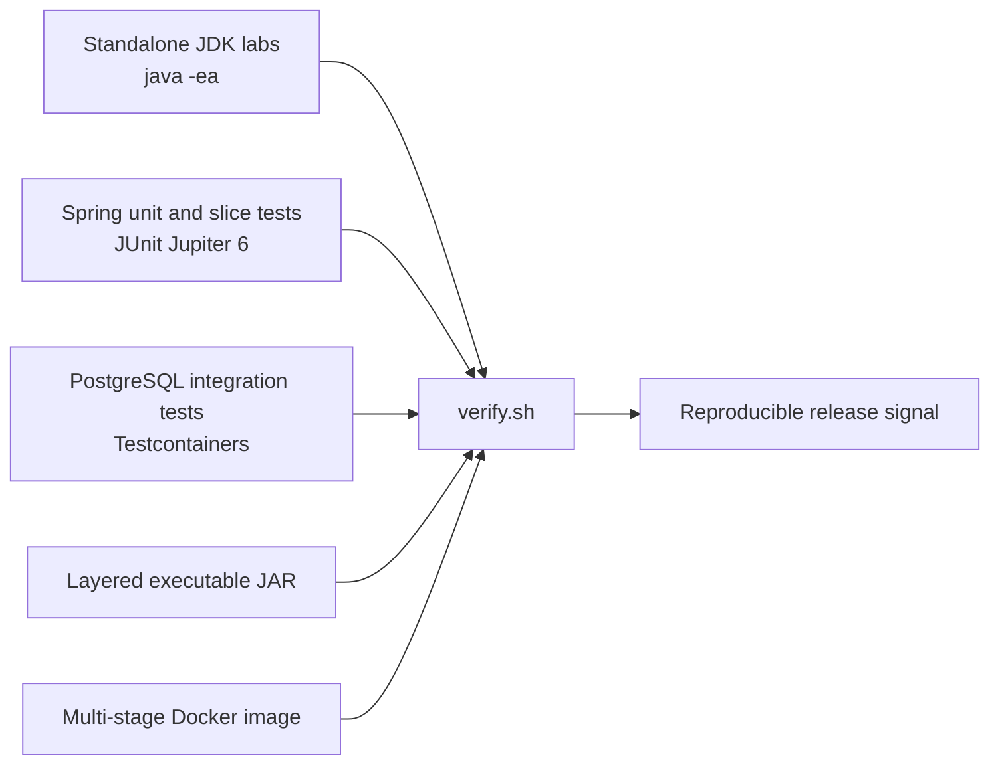

# LTS Java Lab

[](https://openjdk.org/)
[](https://spring.io/projects/spring-boot)
[](https://www.postgresql.org/)
[](https://testcontainers.com/)
[](LICENSE)

An executable engineering laboratory for modern Java, Spring-based services,
and evidence-driven verification.

The repository turns language rules, framework behavior, persistence semantics,
and deployment assumptions into small experiments with explicit boundaries. It
is intentionally stricter than a collection of code samples: portable contracts
are asserted, runtime details are observed, and operational claims are kept out
of unit tests unless the required environment is present.

## What this project demonstrates

| Area | Technologies and engineering focus |
|---|---|
| Modern Java | Java 21 compatibility floor, Java 25 LTS release runtime, virtual threads, records, sealed types, pattern matching, serialization filters, reference types, collections and concurrency contracts |
| Service architecture | Spring Boot 4.1, Spring Framework 7, dependency injection, bean lifecycle, conditional auto-configuration and graceful shutdown |
| Data and transactions | Jakarta Persistence, Hibernate ORM, transaction proxies, dirty checking, fetch planning, optimistic locking and explicit pool boundaries |
| API engineering | Spring MVC, Jakarta Validation, RFC 9457 Problem Details and contract-focused MockMvc tests |
| Security | Spring Security 7, stateless OAuth 2.0 resource-server configuration and authentication-versus-authorization boundaries |
| Reliability patterns | Idempotent message handling, transactional inbox/outbox behavior and rollback-safe failure injection |
| Observability | Spring Boot Actuator, Micrometer, bounded metric cardinality, health probes and safe endpoint exposure |
| Verification | JUnit Jupiter 6, AssertJ, Spring test slices, ApplicationContextRunner, Testcontainers and PostgreSQL 16 |
| Delivery | Maven, layered executable JARs, multi-stage Docker builds, non-root runtime and container-aware JVM sizing |

## Verification model

The lab separates three kinds of engineering claims:

1. **Portable contracts** — behavior guaranteed by the Java specification, JDK
   API, framework contract or database transaction model. These become
   assertions.
2. **Implementation observations** — behavior that may vary by runtime, garbage
   collector or release. These are printed and inspected, never promoted to
   correctness requirements.
3. **Operational hypotheses** — throughput, latency, allocation, failover and
   production shutdown behavior. These require benchmarks, profiling or a
   deployed environment; a green unit test is not accepted as proof.

This distinction prevents a common testing failure: encoding today’s runtime
behavior as if it were a permanent platform guarantee.



## Run the lab

### Prerequisites

- JDK 21 or newer
- Maven 3.9+
- Docker for PostgreSQL integration tests and image verification

Java 21 is the compilation and compatibility floor. Java 25 LTS is the release
runtime used for the complete gate.

### One-command verification

```bash
# Complete suite: JDK labs, Spring tests, PostgreSQL and packaging
./verify.sh "$(/usr/libexec/java_home -v 25)/bin/java"

# Complete suite plus a real Docker image build
./verify.sh "$(/usr/libexec/java_home -v 25)/bin/java" --docker

# Java 21 compatibility lane without container-backed tests
./verify.sh "$(/usr/libexec/java_home -v 21)/bin/java" --no-containers

# Fast language/runtime loop
./verify.sh "$(/usr/libexec/java_home -v 25)/bin/java" --jdk-only
```

On Linux or in CI, pass the active JDK directly:

```bash
./verify.sh "$JAVA_HOME/bin/java" --docker
```

The command exits successfully only when every selected check passes.
Standalone Java labs run with assertions enabled; Spring tests run through
Maven Surefire and Failsafe; the packaging gate inspects all four Spring Boot
JAR layers.

## Repository structure

```text
.
├── labs/                         # Source-file JDK experiments
├── src/main/java/               # Small Spring application and domain slices
├── src/test/java/               # Unit, slice and integration verification
├── docs/
│   ├── architecture.md          # Verification planes and design decisions
│   └── verification-matrix.md   # Claim-to-test coverage and boundaries
├── .github/workflows/ci.yml     # Java 21 compatibility + Java 25 release gate
├── Dockerfile                   # Layered, non-root Java 25 runtime image
├── pom.xml                      # Spring Boot 4.1 / Java 21 build baseline
└── verify.sh                    # Reproducible local and CI entry point
```

## Selected scenarios

- Prove atomic `ConcurrentHashMap.computeIfAbsent` behavior under contention
  without asserting OpenJDK’s internal locking strategy.
- Demonstrate why weak-reference clearing time and lambda instance reuse are
  observations rather than contracts.
- Exercise transaction proxy self-invocation and checked-exception rollback
  rules.
- Measure JPA N+1 behavior, then verify an explicit fetch-plan repair.
- Run two concurrent PostgreSQL writers and verify optimistic-lock conflict
  handling.
- Validate OAuth 2.0 authentication and authorization as separate controls.
- Verify bounded metric cardinality and Micrometer gauge ownership.
- Execute additive schema migration, JDBC batching and HikariCP admission
  limits against PostgreSQL 16.
- Prove that deduplication, a local business effect and an outbox record commit
  atomically.
- Build and inspect a layered Spring Boot JAR, then assemble a non-root Java 25
  container image.

The full catalog and each experiment’s limits are documented in the
[verification matrix](docs/verification-matrix.md).

## Deliberate boundaries

This repository does not claim that a passing build proves:

- arbitrary concurrent algorithms are race-free;
- a workload meets latency, throughput or allocation targets;
- a container image is production-ready for every platform;
- database behavior is portable beyond the engine and version under test;
- inbox/outbox persistence alone guarantees broker delivery;
- graceful application shutdown guarantees load-balancer or orchestrator
  correctness.

Those questions belong to JCStress, JMH, JFR, load tests, broker fault
injection and deployment-level acceptance tests. The boundary is part of the
engineering result, not a disclaimer added afterward.

## Documentation

- [Architecture and verification planes](docs/architecture.md)
- [Verification matrix](docs/verification-matrix.md)

## License

Licensed under the [Apache License 2.0](LICENSE).
