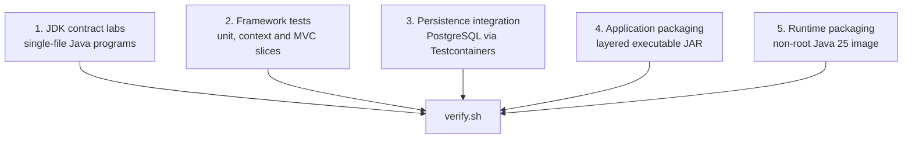

# Architecture and verification strategy

## Purpose

LTS Java Lab is a compact executable system for answering engineering questions
with the smallest environment that can answer them honestly. It favors
high-signal experiments over broad example applications.

The design has five verification planes:

Each claim is routed to the lowest plane with sufficient fidelity. A Java API
contract does not need Spring. An optimistic-locking claim does need a real
database. A container build does not need a Kubernetes cluster, but a
zero-downtime deployment claim would.

## Plane 1 — JDK contract labs

The files under `labs/` run directly with Java source-file launching and `-ea`.
They deliberately avoid Maven and framework startup so language and runtime
semantics remain visible.

Design rules:

- assert specification and API contracts;
- print implementation-dependent observations;
- avoid assertions about garbage-collection timing, object identity or private
  runtime representation;
- keep each experiment independently executable.

## Plane 2 — framework and API behavior

Focused Spring tests verify lifecycle, transaction, MVC, security, metrics and
auto-configuration behavior.

The suite uses the narrowest useful context:

- plain `AnnotationConfigApplicationContext` for lifecycle behavior;
- `ApplicationContextRunner` for conditional auto-configuration;
- MVC slice tests for HTTP contracts;
- a full application context only when transaction or persistence wiring is
  part of the claim.

This keeps failures local and avoids treating a large green context as evidence
for behavior it never exercised.

## Plane 3 — database integration

PostgreSQL 16 runs through Testcontainers when engine semantics matter.

Container-backed tests cover:

- optimistic locking with two concurrent transaction writers;
- additive schema migration and backfill;
- JDBC batching;
- explicit HikariCP connection limits.

H2 remains available for fast framework tests whose claim is not
engine-specific. It is never used as a substitute for PostgreSQL behavior.

## Plane 4 — application packaging

Maven produces an executable Spring Boot JAR compiled with `--release 21`.
The verification entry point confirms the presence of all four standard Boot
layers. This catches packaging drift that unit tests do not see.

## Plane 5 — container runtime

The Dockerfile extracts Spring Boot layers in a builder stage and copies them
into a Java 25 JRE image. The final process:

- runs as a non-root user;
- exposes only the application port;
- uses percentage-based heap sizing suitable for a container limit;
- preserves layer boundaries for efficient rebuilds.

The image build is a packaging check. Deployment security policy, SBOM,
vulnerability scanning, orchestrator probes and rolling-shutdown behavior are
separate controls.

## Version strategy

| Concern | Baseline |
|---|---|
| Compilation | Java 21 (`maven.compiler.release=21`) |
| Compatibility lane | Java 21 |
| Release runtime | Java 25 LTS |
| Framework | Spring Boot 4.1 / Spring Framework 7 |
| Test platform | JUnit Jupiter 6 |
| Integration database | PostgreSQL 16 |

The compatibility lane catches accidental use of APIs newer than Java 21 in the
Spring application. The Java 25 gate exercises the current LTS runtime and
container image.

## Evidence discipline

The project uses an evidence ladder:

1. compile-time constraints;
2. isolated API assertions;
3. focused framework tests;
4. real dependency integration tests;
5. packaging checks;
6. benchmark, profiler or deployed-environment evidence.

Moving higher costs more, so the lab moves only as high as the claim requires.
It also never substitutes a lower-level green check for a higher-level
operational result.
